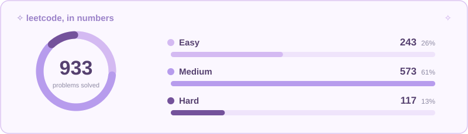
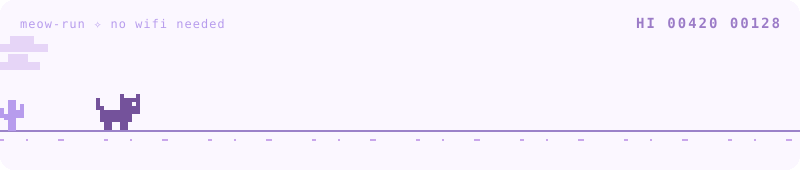
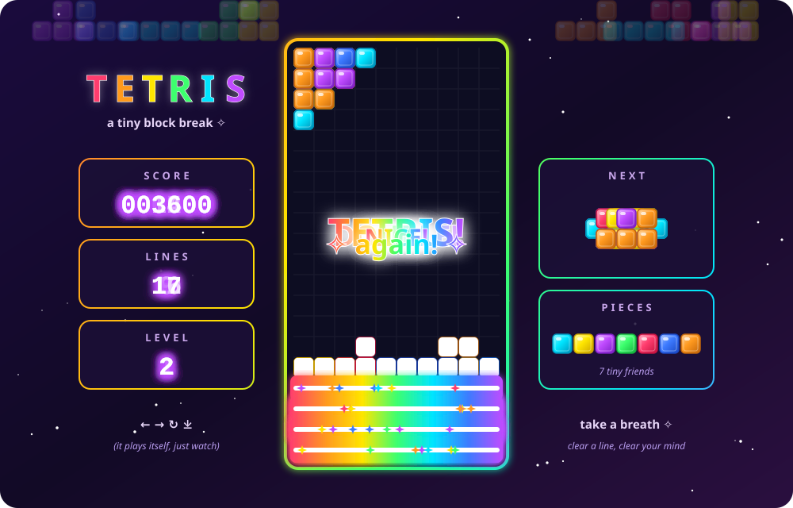

<div align="center">
<a href="https://github.com/alam0604/daily-data-engineering-facts"></a>
<br/>
<sub>✧ a new data engineering pick every morning · <a href="https://github.com/alam0604/daily-data-engineering-facts/blob/main/ARCHIVE.md">past picks</a> ✧</sub>
</div>
<br/>

<div align="center">

</div>
<br/>
<div align="center">


<a href="https://github.com/alam0604">
  
</a>

### ✧ apparently my life is all about ✧

**Data Engineering &nbsp;·&nbsp; Azure &nbsp;·&nbsp; Databricks &nbsp;·&nbsp; PySpark &nbsp;·&nbsp; SQL &nbsp;·&nbsp; MS Fabric &nbsp;·&nbsp; Optimization**

*Building things, solving problems, and finding magic in data.*

[](https://github.com/alam0604)
[](https://www.linkedin.com/in/sahbanalam0604/)

</div>

<p align="center">

</p>


## Me..?


Heyy viewer! I'm a Data Engineer with **3.5+ years of experience** building scalable data engineering solutions on Azure.
I enjoy transforming complex data into meaningful insights, designing efficient pipelines, and exploring better ways to work with big data.

- ☁️ Working with **Azure** and **Databricks**
- ⚡ Building scalable **ETL/ELT pipelines**
- 🪄 Exploring **Spark optimization** and **lakehouse architecture**
- 🌱 Always learning something new

<br clear="right"/>

<div align="center">

</div>


## the schema of me

```sql
CREATE TABLE IF NOT EXISTS alam (
    role                STRING     DEFAULT 'Data Engineer',
    experience_years    DECIMAL    DEFAULT 3.5,          -- and counting
    home_cloud          STRING     DEFAULT 'Azure',
    fav_tools           ARRAY<STRING> DEFAULT ['Databricks', 'PySpark', 'SQL', 'MS Fabric'],
    superpower          STRING     DEFAULT 'making slow jobs fast',
    currently_exploring STRING     DEFAULT 'lakehouse architecture',
    curiosity_level     BIGINT     DEFAULT 9223372036854775807,  -- max value, obviously
    nulls_tolerated     INT        DEFAULT 0
)
USING DELTA
COMMENT 'built with a little magic ✧';
```


## optimization wins

<!-- ✏️ swap these for your real wins + numbers -->
| 🐢 before | ✨ what I did | 🚀 after |
| :--- | :--- | :--- |
| a job crawling through skewed joins | salting + AQE + broadcast joins | runtime cut from **hrs → mins** |
| full table scans on every run | partition pruning + Z-ordering on Delta | **70% less data scanned** |
| thousands of tiny files | `OPTIMIZE` + auto compaction | **faster reads, happier clusters** |
| full reloads every night | incremental loads with `MERGE` | **56% lower compute cost** |


## 🛠️ things I build with

<div align="center">


<br/>

[](https://github.com/alam0604?tab=repositories)

*Every project starts with a little curiosity.*

</div>


## 🧩 leetcode, in numbers

<div align="center">

</div>


## 🎧 on repeat

<div align="center">


<br/><br/>

<a href="https://www.youtube.com/embed/jB0-Ytbtcns?start=0&end=60&autoplay=1"></a>
<a href="https://www.youtube.com/embed/qbvAmlKhWQQ?start=0&end=60&autoplay=1"></a>
<a href="https://www.youtube.com/embed/5uEUPOCNazY?start=0&end=60&autoplay=1"></a>
<a href="https://www.youtube.com/embed/S7tSIv34DRk?start=0&end=60&autoplay=1"></a>
<a href="https://www.youtube.com/embed/vReY9vhye6Y?start=0&end=60&autoplay=1"></a>
<br/>
<a href="https://www.youtube.com/embed/KDe7tK1i6nA?start=0&end=60&autoplay=1"></a>
<a href="https://www.youtube.com/embed/rBiblCpTw7s?start=0&end=60&autoplay=1"></a>
<a href="https://www.youtube.com/embed/gWkfwmCLvcc?start=0&end=60&autoplay=1"></a>
<a href="https://www.youtube.com/embed/oQGLJCAKMlU?start=0&end=60&autoplay=1"></a>
<a href="https://www.youtube.com/embed/oQEGi_8PTMs?start=0&end=60&autoplay=1"></a>

<br/>


</div>


## 🐾 a tiny offline break

<div align="center">

</div>

<div align="center">

</div>


## read this...

<details>
<summary><b>pssst... there's a little something for you</b></summary>

<br/>

> If you've made it this far, here's a little reminder:
>
> **You don't have to have everything figured out.**
> Keep learning, keep creating, keep being curious.
> And never stop finding magic in the little things. ✨
>
> Here's a tiny cookie for your journey 🍪

</details>

<br/>

<div align="center">

### ✨ a little magic, a little code, and a lot of curiosity.

*thanks for visiting my side of GitHub*


</div>
